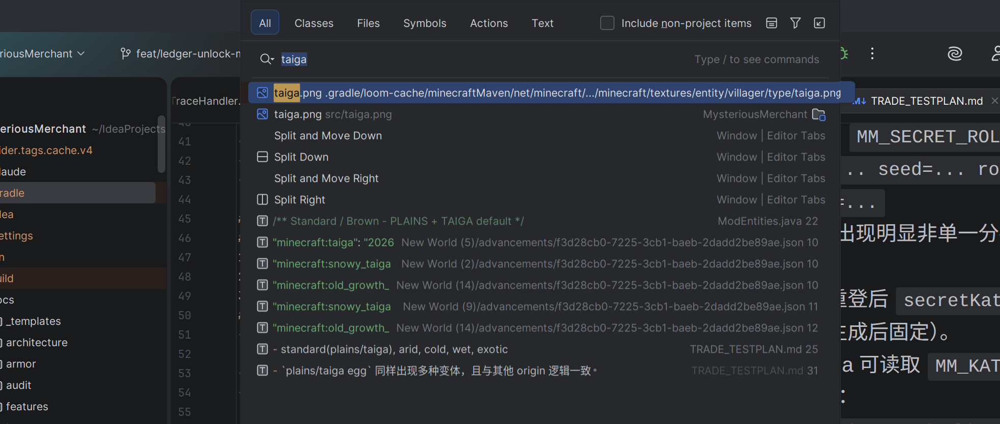

# Trade Test Plan (One-Cut Fix Verification)

> 本文用于验证 3 个主问题一次性修复：UI 按钮稳定、spawn egg 乱入一致、katana 跨商人全局防重复购买。

## 环境准备
- [ ] 开发环境运行客户端：`./gradlew runClient`
- [ ] 确认调试开关开启（开发环境默认）：`TradeConfig.MASTER_DEBUG=true`
- [ ] 日志窗口准备：`tail -f run/logs/latest.log | grep "MoonTrade"`

## T1 UI 按钮稳定性（next/prev/refresh）
### Steps
1. `/summon xqanzd_moonlit_broker:mysterious_merchant` 打开交易界面。
2. 检查右上 `prev/next/refresh` 是否出现。
3. 连续执行：翻页 -> refresh -> 关闭界面 -> 重开界面。
4. 重复 10 次以上，观察按钮是否丢失、点击区是否被标题覆盖。
### Expected
- 每次 `init` 日志出现 `MM_UI_INIT`。
- 每次布局初始化至少出现一次 `MM_UI_LAYOUT titleWidth/buttonsLeftX/titleX`。
- 按钮在 `offers rebuild` / 重开界面后不消失；标题不覆盖按钮点击区。
- 当 offers <= pageSize 时，`prev/next` 隐藏，`refresh` 仍显示。

## T2 Spawn Egg 乱入一致性（5 个 egg + 第 6 个 debug 随机 egg）
### Steps
1. 创造模式拿到 5 个气候 egg：
   - standard(plains/taiga), arid, cold, wet, exotic
2. 分别对每个 egg 刷 100 次（建议记录日志统计）。
3. 额外用第 6 个 `mysterious_merchant_debug_random_spawn_egg` 刷 100 次。
### Expected
- 每次刷出都记录 `MM_EGG_SPAWN origin=... rolled=... seed=... playerUuid=... pos=...`
- `cold egg` 不再是 100% cold，能出现非 cold 变体（按 70/10/10/8/2 表）。
- `plains/taiga egg` 同样出现多种变体，且与其他 origin 逻辑一致。
- `debug egg` 会随机 origin，再走同一张概率表。

## T3 隐藏神器权重与 NBT 固化
### Steps
1. 连续生成/重开 50 个商人实体，记录 `MM_SECRET_ROLL` 与 `MM_SECRET_PICK`。
2. 对同一商人退出重进世界，再次检查其 `secretKatanaId` 是否变化。
3. 完成隐藏交易，检查输出 katana 的自定义数据是否带 `MM_KATANA_ID`。
### Expected
- 日志出现：`MM_SECRET_ROLL variant=... seed=... roll=... chosenId=...`
- 50 次内应出现明显非单一分布（非全是同一把）。
- 同一实体重登后 `secretKatanaId` 不变（首次生成后固定）。
- 输出 katana 可读取 `MM_KATANA_ID`（short id：`moonglow/regret/eclipse/oblivion/nmap`）。

## T4 跨商人全局防重复购买（服务端强制）
### Steps
1. 玩家 A 购买某 `katanaId`（例如 `moonglow`）。
2. 再遇到不同商人（不同 uuid、不同 variant），若售卖同 `katanaId`，尝试再次购买。
3. 再次打开 UI，观察该 katana offer 展示状态。
### Expected
- 重复购买在服务端结算点被拦截，日志出现：
  - `MM_KATANA_BLOCK player=... katanaId=... merchant=...`
- 被拦截时输入材料不消耗，输出槽不产出第二把 katana。
- 首次成功购买会记录：
  - `MM_KATANA_OWNED_ADD ...`
  - `MM_PURCHASED ...`
- `rebuild/open UI` 后该玩家同 `katanaId` 显示 sold out（日志 `MM_SOLD_OUT_SHOWN`）。
- 不删除 `Arcane Ledger` 交易，不因 sold out 发生 offers 重排。

## 建议 grep
```bash
grep -E "MM_UI_INIT|MM_UI_LAYOUT|MM_EGG_SPAWN|MM_SECRET_ROLL|MM_SECRET_PICK|MM_KATANA_BLOCK|MM_KATANA_OWNED_ADD|MM_PURCHASED|MM_SOLD_OUT_SHOWN" run/logs/latest.log | tail -n 400
```
